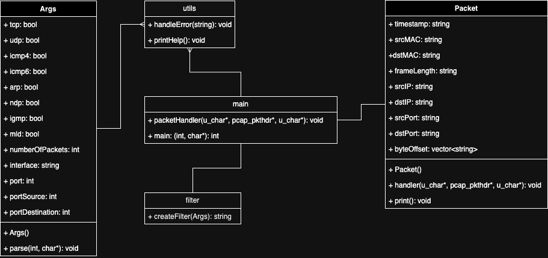
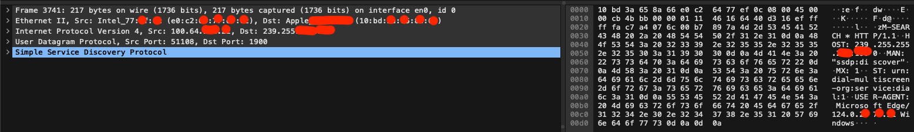
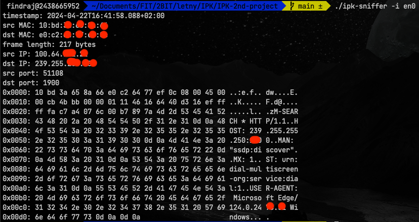

# IPK-2nd-project

## Design



I decided to implement 2 classes.  
First class is class Args, which contains all possible arguments for the program. It contains function `parse` which parse input arguments and fill the class variables.  
The second class Packet contains all information about packet. It contains functions `handler` which parse packet from raw data and function `print` which prints the packet in the required format.  
The main part of the program is in the `main` file.  
Utilities such as `printHelp` and `handleError` are in the `utils` file.

## Implementation

### Args

The `Args` class is responsible for parsing the input arguments and storing them in the class variables.

### Packet

The `Packet` class is responsible for parsing the raw packet data and storing it in the class variables. There is also function `print` which prints the packet in the required format.

### Main

The `main` file contains the main part of the program. It uses other classes and functions to parse input arguments, open the socket, and start sniffing packets.

### Utils

The `utils` file contains utility functions such as `printHelp` and `handleError`.

## Compilation

To compile the program, run the following command:

```bash
make
```

To remove the compiled files, run the following command:

```bash
make clean
```

To pack the project into a file for submission, run the following command:

```bash
make pack
```

## Usage

The program can be run using the following command:

```bash
./ipk-sniffer [-i interface] [-t] [-u] [-p port] [--icmp4] [--icmp6] [--arp] [--ndp] [--igmp] [--mld] [-n num]
```

The `ipk-sniffer` command allows for packet sniffing with various filtering options. Below is the breakdown of its usage:

- `-i interface` or `--interface interface`: Specifies the network interface to sniff on. If no interface is provided, or if only `-i/--interface` is given without a value, a list of active interfaces is displayed.

- `-t` or `--tcp`: Displays TCP segments. This option can be complemented by `-p` or `--port-*` functionality for port-based filtering.

- `-u` or `--udp`: Displays UDP datagrams. Similar to TCP, this option can be complemented by `-p` or `--port-*` functionality for port-based filtering.

- `-p`, `--port-source`, `--port-destination port`: Extends the filtering to TCP/UDP based on port number. If no filtering by port number is specified, this parameter can be omitted. Ports can occur in either the source or destination part of TCP/UDP headers.

- `--icmp4`: Displays only ICMPv4 packets.

- `--icmp6`: Displays only ICMPv6 echo request/response packets.

- `--arp`: Displays only ARP frames.

- `--ndp`: Displays only NDP packets, a subset of ICMPv6.

- `--igmp`: Displays only IGMP packets.

- `--mld`: Displays only MLD packets, also a subset of ICMPv6.

- `-n num`: Specifies the number of packets to display. If not specified, it defaults to displaying only one packet.

### Output Format

Example output of the program:

```
$ sudo ./ipk-sniffer -i en0
timestamp: 2024-04-22T14:39:09.089+02:00
src MAC: 10:bd:3a:00:00:00
dst MAC: 14:f6:d8:00:00:00
frame length: 20 bytes
src IP: 100.64.000.000
dst IP: 239.255.000.000
src port: 56751
dst port: 1900
0x0000: 10 bd 3a 65 8a 66 14 f6 d8 e3 18 18 08 00 45 00 ..:e.f.. ......E.
0x0010: 00 99 0d 3c 00 00 ff 11 8e 6c 64 40 cb 70 ef ff ...<.... .ld@.p..
0x0020: ff fa dd af 07 6c 00 85 cc 93 4d 2d 53 45 41 52 .....l.. ..M-SEAR
0x0030: 43 48 20 2a 20 48 54 54 50 2f 31 2e 31 0d 0a 48 CH * HTT P/1.1..H
0x0040: 4f 53 54 3a 20 32 33 39 2e 32 35 35 2e 32 35 35 OST: 239 .255.255
0x0050: 2e 32 35 30 3a 31 39 30 30 0d 0a 4d 41 4e 3a 20 .250:190 0..MAN:
0x0060: 22 73 73 64 70 3a 64 69 73 63 6f 76 65 72 22 0d "ssdp:di scover".
0x0070: 0a 4d 58 3a 20 31 0d 0a 53 54 3a 20 75 72 6e 3a .MX: 1.. ST: urn:
0x0080: 64 69 61 6c 2d 6d 75 6c 74 69 73 63 72 65 65 6e dial-mul tiscreen
0x0090: 2d 6f 72 67 3a 73 65 72 76 69 63 65 3a 64 69 61 -org:ser vice:dia
0x00a0: 6c 3a 31 0d 0a 0d 0a                            l:1....
```

- timestamp is in [RFC 3339](#bibliography) format
- frame length is in bytes

## Testing

Testing was done on macOS Sonoma and also in docker container running `debina:11` image. Locally I don't have root access so I had to use `sudo` to run the program.  
The program was tested with various combinations of arguments and on different network interfaces.

```bash
$ sudo ./ipk-sniffer -i en0
$ sudo ./ipk-sniffer -i en0 -u --port-destination 1900
$ sudo ./ipk-sniffer -i en0 -arp
.
.
.
```



Then I manually checked the output of the program in comparison with [Wireshark](#bibliography).

## Bibliography
1. RFC 3339 - https://www.rfc-editor.org/rfc/rfc3339
2. Wireshark - https://www.wireshark.org/